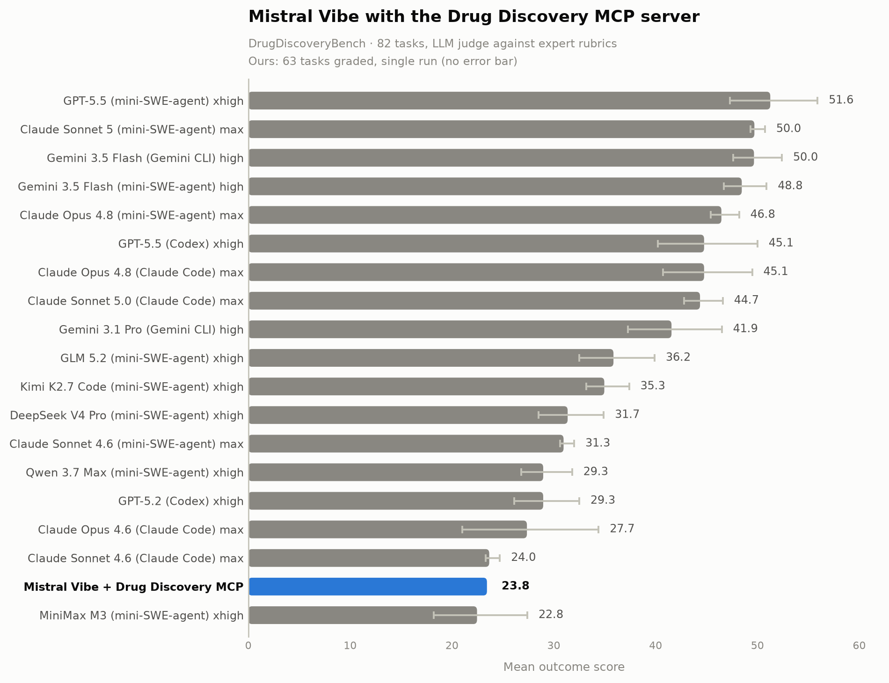

# Drug Discovery MCP Server 🧬⚡

**An MCP server that gives [Mistral Vibe](https://github.com/mistralai/mistral-vibe) 30+ live drug discovery tools — then measures what they're worth on [DrugDiscoveryBench](https://github.com/scaleapi/DrugDiscoveryBench), 82 expert-authored tasks graded against rubrics by an LLM judge.**

> Built on the [official MCP Python SDK](https://github.com/modelcontextprotocol/python-sdk). Every database tool hits a live API — no fixtures, no cached snapshots. Register it with one command and Vibe can pull p53's sequence, score a compound against Lipinski, or superimpose two crystal structures and get an RMSD.

| | Result |
|---|---|
| **Benchmark score** | **23.8** mean outcome on DrugDiscoveryBench (63 tasks) |
| **Tasks solved outright** | **10** · 21 scoring above zero |
| **Tools exposed** | **30** over MCP — 10 database, 10 cheminformatics, 10 structural biology |
| **Full suite runtime** | **~2.5 h** on a laptop, no container, 6-way concurrency |

<p align="center">
  
</p>

*Agent: Mistral Vibe (`mistral-vibe-cli-latest`) · Judge: `mistral-large-latest` · scored by each task's own `judge.py` against the gated expert rubrics. Published leaderboard figures carry ± standard error over repeated trials; ours is a single run.*

<!-- BENCH:START -->

Agent **Mistral Vibe** (`mistral-vibe-cli-latest`) with this project's MCP
server registered; judge **`mistral-large-latest`**. Run in progress (63/82), last updated 2026-08-23 00:13 UTC.

| metric | value |
|---|---|
| tasks graded | 63 / 82 |
| **mean score** (outcome) | **0.238** |
| solved (1.0) | 10 |
| partial (0 < s < 1) | 11 |
| zero | 42 |
| no answer produced | 6 |
| judge failures | 0 |

Top 10 tasks:

| score | task |
|---|---|
| 1.000 | `69b34fde93a696047cbf9c73` |
| 1.000 | `69b43e08f5a8ac5b38e3c5f0` |
| 1.000 | `69b43e08f5a8ac5b38e3c5f3` |
| 1.000 | `69b43e08f5a8ac5b38e3c60e` |
| 1.000 | `69b43e08f5a8ac5b38e3c617` |
| 1.000 | `69b43e08f5a8ac5b38e3c62b` |
| 1.000 | `69b43e08f5a8ac5b38e3c637` |
| 1.000 | `69e6b5dade74c4d1f5fa934c` |
| 1.000 | `69e6b5dade74c4d1f5fa9350` |
| 1.000 | `69e6b5dade74c4d1f5fa9351` |

Scored by each task's own `judge.py` against the gated expert rubrics.

<!-- BENCH:END -->

---

## The story: how the harness got better every iteration

The first end-to-end run scored **0.429** on its task. Nothing about the model changed after that — every gain below came from fixing the harness around it.

| # | Change | What was wrong | Effect |
|--:|---|---|---|
| 1 | **Baseline** | Vibe answers, the task's own judge grades | 0.429 on the colon/Moertel task |
| 2 | **Ground answers in retrieved data** | Agent answered from memory; recalled figures were wrong in detail | **0.429 → 0.714** on the same task |
| 3 | **Skip process grading** | Judge chunked a 456 KB trajectory on every task | **39 s → 9 s**, score provably unchanged |
| 4 | **6-way concurrency** | One task at a time | **4.3×** — 6 tasks in 16 min vs ~69 min serial |
| 5 | **Fix the answer path** | Agent nested `answer.md`; fallback grabbed chat prose | clean terse answers, no prose penalty |
| 6 | **Survive turn-limit exits** | Vibe discards the whole transcript on turn limit | no-answer rate **1-in-9 → 1-in-37** |

**Reading the story:**

1. **Baseline (0.429).** The loop worked, but the agent reasoned from memory and got the historical figure wrong.
2. **The single biggest win.** Adding *"do not answer from memory — fetch the underlying data and compute it"* flipped the final answer from YES to NO and drove the agent to actually retrieve the dataset. One prompt section, **+0.285** on that task.
3. **Free speed.** `judge.py` computes `score = outcome_pct / 100` — the process rubric is graded and stored but never reaches the score. Skipping it is a 4× faster judge for zero information loss.
4. **Concurrency is real.** Six concurrent Vibe sessions ran without Mistral rate-limiting, taking the suite from ~5.2 h to ~2.5 h.
5. **Harness bugs cost score.** The agent wrote `answer.md` into a nested path, so the fallback used its chat reply — prose the rubric penalises.
6. **Still leaking.** On a turn-limit exit Vibe writes the stop event to *stderr* and nothing to stdout, discarding the session. ~8% of runs score zero for this reason rather than for being wrong — worth **+0.024** on the mean.

---

## What it is

Three domains of tools, exposed over MCP, all hitting live APIs.

```
        Mistral Vibe  (or any MCP client)
                │
                │  MCP · stdio / streamable-http / sse
                ▼
      ┌───────────────────────────────────┐
      │     Drug Discovery MCP Server     │
      ├───────────┬───────────┬───────────┤
      │ Databases │   Chem-   │Structural │
      │   (10)    │informatics│  biology  │
      │           │   (10)    │   (10)    │
      └───────────┴───────────┴───────────┘
            │           │           │
       UniProt       RDKit      Biopython
       ChEMBL     descriptors   PDB parse
       PDB        fingerprints  superpose
       PubChem    similarity    RMSD
       KEGG       drug-likeness binding site
       NCBI       ADMET         contacts
       OpenTargets conformers   SASA
```

**Databases** — `query_uniprot` `query_chembl` `query_pdb` `query_pubchem` `query_kegg` `query_ncbi` `query_opentargets` `search_compounds` `search_proteins` `search_patents`

**Cheminformatics** — `calculate_descriptors` `molecular_similarity` `calculate_fingerprint` `check_drug_likeness` `predict_admet` `smiles_to_inchi` `inchi_to_smiles` `generate_conformers` `optimize_geometry` `calculate_charge`

**Structural biology** — `download_pdb` `parse_pdb` `superimpose_structures` `calculate_rmsd` `analyze_binding_site` `find_interactions` `analyze_conformation` `compare_structures` `extract_ligand` `analyze_solvent_accessibility`

Six more clients are built and tested — AlphaFold, Europe PMC, ClinicalTrials.gov, Reactome, ClinVar and GTEx — in [`databases/science.py`](drug_discovery_mcp/databases/science.py),

---

## Quick start

```bash
pip install -e ".[rdkit]"

# stdio — what desktop MCP clients launch
drug-discovery-mcp

# or over HTTP
drug-discovery-mcp --transport streamable-http --port 8080
```

Register with **Mistral Vibe**:

```bash
vibe mcp add drug-discovery --transport stdio \
  --command /path/to/drug-design-agent/.venv/bin/drug-discovery-mcp
```

```
> Call query_uniprot with accession P04637 and report the entry_name.
entry_name: P53_HUMAN
```

With **Claude Desktop** or any MCP client:

```json
{ "mcpServers": { "drug-discovery": { "command": "drug-discovery-mcp" } } }
```

A REST/OpenAPI interface over the same tools — *not* MCP — runs as `drug-discovery-mcp-http`.

---

## Running the benchmark

DrugDiscoveryBench ships 82 tasks whose rubrics live in a gated HuggingFace dataset. Populate them first, or every task scores zero.

```bash
git clone https://github.com/scaleapi/DrugDiscoveryBench.git
cd DrugDiscoveryBench && PYTHONUTF8=1 python scripts/populate_rubrics.py
```

**Without Docker** — each task's `judge.py` is a standalone rubric judge, so Vibe answers on the host with the MCP tools registered and the task's own judge scores it:

```bash
export MISTRAL_API_KEY=...
python integrations/run_task_local.py 69b025e20c10fe76b7aaf812   # one task
python integrations/run_all_local.py --workers 6                 # all 82
python integrations/run_all_local.py --summary-only              # scores
```

**With Docker** — the official Harbor harness. Harbor ships agent adapters for Claude Code, Codex and Gemini CLI but **not Vibe**, so [`integrations/vibe_agent.py`](integrations/vibe_agent.py) supplies one: it installs Vibe in the trial container, registers MCP servers via `vibe mcp add`, and converts Vibe's transcript into Harbor's ATIF trajectory format. Harbor has first-class MCP support, so our tools drop into a trial through `task.toml` with no fork:

```bash
python integrations/add_mcp_to_tasks.py /path/to/DrugDiscoveryBench
MISTRAL_API_KEY=... ./integrations/run_vibe_task.sh <task_id>
```

Results land in `local_runs/<task_id>/` — `answer.md`, the Vibe transcript, `reward.json` (0–1) and `grades_detail.json` (per-criterion breakdown).

---

## Repository layout

```
drug_discovery_mcp/
  mcp_server.py            # the MCP server — 30 tools, stdio/HTTP/SSE
  server.py                # REST/OpenAPI interface over the same tools
  databases/               # UniProt, ChEMBL, PDB, PubChem, KEGG, NCBI, OpenTargets
    science.py             #   + AlphaFold, EuropePMC, ClinicalTrials, Reactome,
                           #     ClinVar, GTEx  (built, pending registration)
  cheminformatics/         # RDKit: descriptors, fingerprints, ADMET, drug-likeness
  structural_biology/      # Biopython: parsing, superposition, binding sites
  tasks/                   # task runner + rubric evaluation
integrations/
  run_task_local.py        # Docker-free: Vibe answers → the task's judge grades
  run_all_local.py         # sweeps all 82, resumable, concurrent
  vibe_agent.py            # Harbor agent adapter for Mistral Vibe
  add_mcp_to_tasks.py      # stamps the MCP server into task.toml
tests/                     # 151 tests
```

---

## Reproduce

```bash
pytest                                                    # 151 tests
python integrations/run_all_local.py --workers 6          # the full sweep
python integrations/update_readme_scores.py               # refresh the results block

# Harbor adapter tests (Harbor requires Python 3.12+)
uv tool run --with pytest --from harbor==0.13.1 pytest integrations/
```

---

<sub>MCP server on the official Python SDK · live UniProt / ChEMBL / PDB / PubChem / KEGG / NCBI / OpenTargets · RDKit + Biopython · evaluated with Mistral Vibe on DrugDiscoveryBench.</sub>
